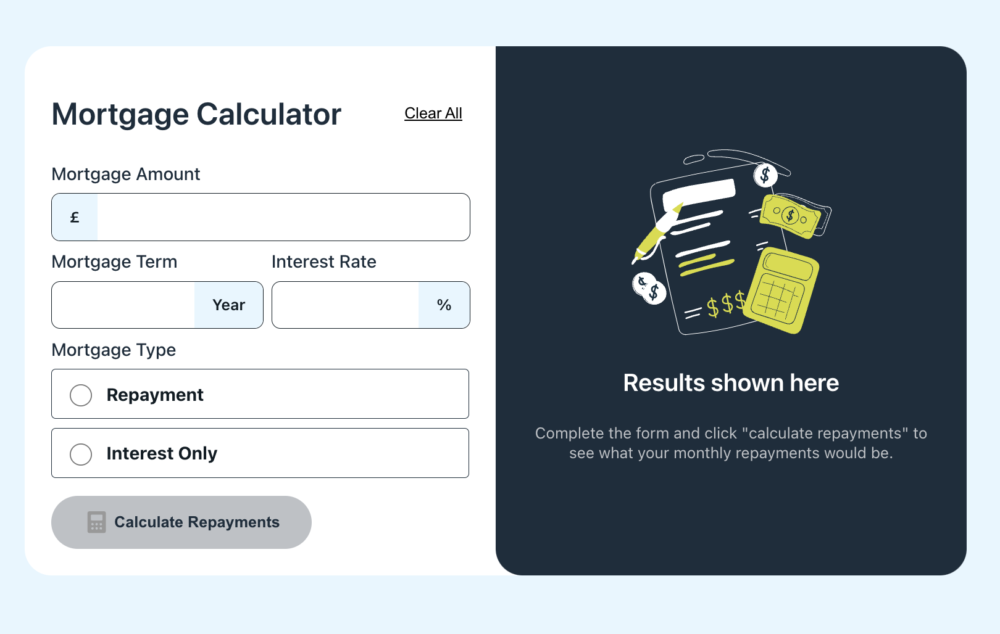
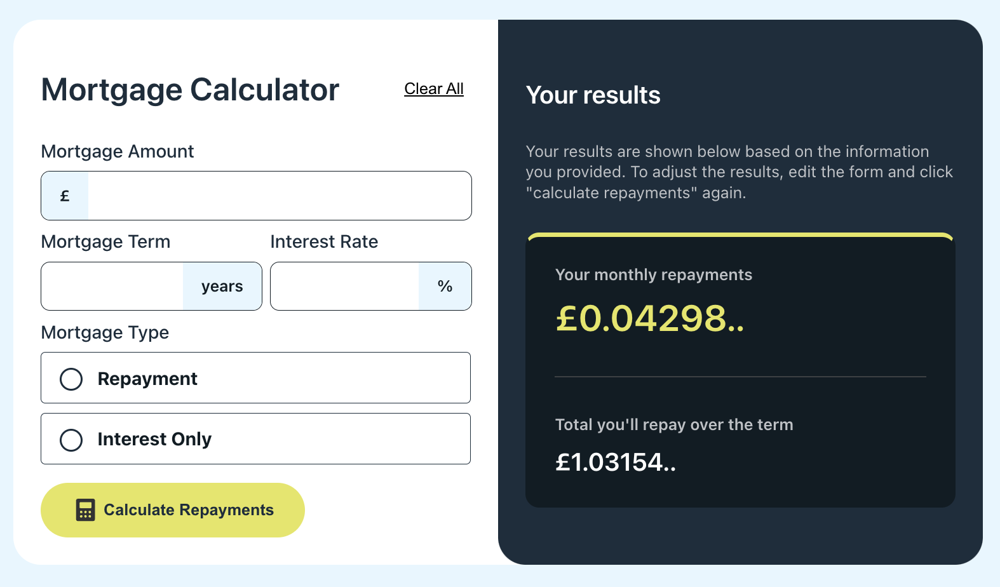
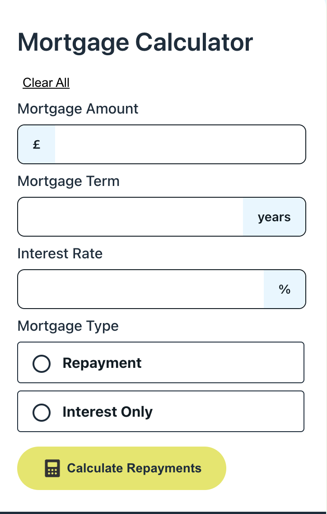
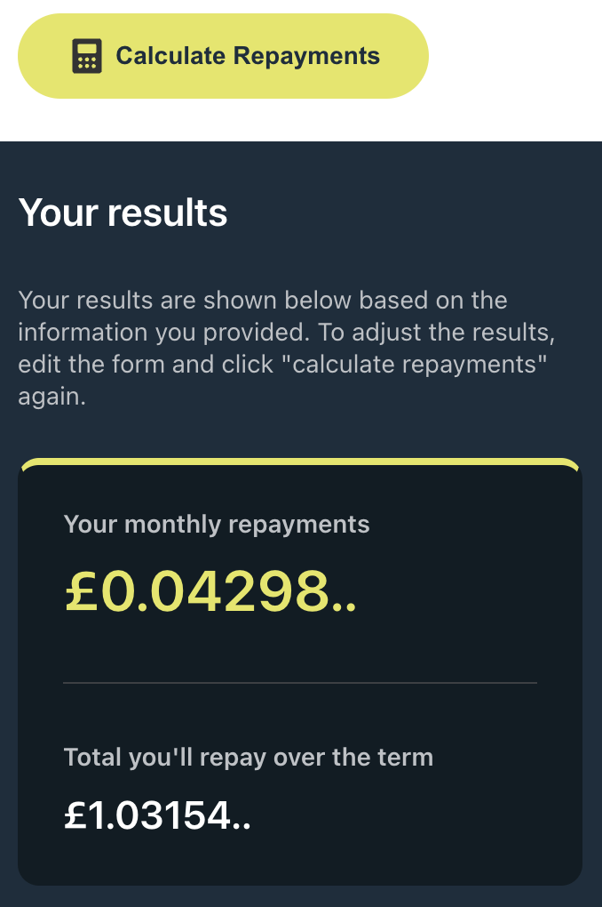

# 프론트엔드 과제 테스트 연습 - Mortgage repayment calculator solution

## 목차

- [Overview](#overview)
  - [문제 설명](#문제-설명)
  - [스크린샷](#스크린샷)
  - [링크](#링크)
- [나의 풀이](#나의-풀이)
  - [Built with](#built-with)
  - [구현 설명](#구현-설명)
  - [Useful resources](#useful-resources)
- [Author](#author)

## Overview

### 문제 설명

유저가 가능한 기능 목록:

- [x] 모기지 정보를 입력하고 양식을 제출한 후 월 상환액 및 총 상환액을 확인할 수 있습니다.
- [x] 필드가 누락된 경우 폼 유효성 검사 메시지를 볼 수 있습니다.
- [x] 키보드만 사용하여 양식을 완성할 수 있습니다.
- [x] 장치의 화면 크기에 따라 인터페이스의 최적 레이아웃을 볼 수 있습니다.
- [x] 페이지의 모든 인터랙티브 요소에 대해 호버 및 포커스 상태를 볼 수 있습니다.

### 스크린샷

### 링크

- 원본문제 URL: [Question URL](https://www.frontendmentor.io/challenges/mortgage-repayment-calculator-Galx1LXK73)

## 나의-풀이

### 사용 기술

- [Vite](https://vitejs.dev/) - 빠른 프론트엔드 빌드 도구
- [React](https://reactjs.org/) - 유저 인터페이스 구축용 JS library
- [Twin.macro](https://github.com/ben-rogerson/twin.macro?tab=readme-ov-file) - Tailwind와 css-in-js 라이브러리를 함께 사용 할 수 있게 하는 도구
- [Tailwind-css](https://tailwindcss.com/) - 유틸리티 기반 CSS 프레임워크
- [Emotion](https://emotion.sh/docs/introduction) - Css-in-JS 라이브러리

### 구현 설명

1. 공통 컴포넌트 개발

### Useful resources

- [Example resource 1](https://www.example.com) - This helped me for XYZ reason. I really liked this pattern and will use it going forward.

## Author

- Website - [Lee Jiho](https://www.your-site.com)
